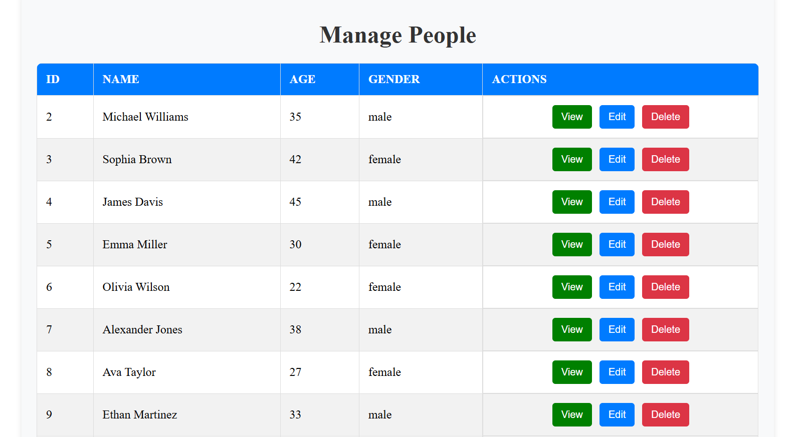

# Manage People App

This is a simple web application developed with Angular, designed to manage a list of people. It allows users to add, view, edit, and delete people from the list.

## Features

*   **Add People:** Users can add new people to the list by providing their details.
*   **View People:** The app displays a list of all the people added.
*   **Edit People:** Existing people's information can be modified.
*   **Delete People:** People can be removed from the list.

## Screenshots



## Technologies Used

*   **Angular:** A TypeScript-based web application framework.
*   **Angular CLI:** For scaffolding and development.
*   **TypeScript:** A typed superset of JavaScript.
*   **HTML/CSS:** For structuring and styling the application.

## Getting Started

This project was generated using [Angular CLI](https://github.com/angular/angular-cli) version 19.2.4.

### Prerequisites

Before you begin, make sure you have the following installed:

*   Node.js (with npm)
*   Angular CLI (you can install it globally using `npm install -g @angular/cli`)

## Development server

To start a local development server, run:

```bash
ng serve
```

Once the server is running, open your browser and navigate to `http://localhost:4200/`. The application will automatically reload whenever you modify any of the source files.

## Dummy APIs for Data

This application can leverage dummy data from [dummyjson.com](https://dummyjson.com/). Specifically, it can use the following endpoint to retrieve user data:

*   **Users:** `https://dummyjson.com/users`

You can integrate these APIs to populate your application with realistic user data. The structure of the data returned from the `users` endpoint is detailed on the [dummyjson documentation](https://dummyjson.com/docs/users) page.


## Code scaffolding

Angular CLI includes powerful code scaffolding tools. To generate a new component, run:

```bash
ng generate component component-name
```

For a complete list of available schematics (such as `components`, `directives`, or `pipes`), run:

```bash
ng generate --help
```

## Building

To build the project run:

```bash
ng build
```

This will compile your project and store the build artifacts in the `dist/` directory. By default, the production build optimizes your application for performance and speed.

## Running unit tests

To execute unit tests with the [Karma](https://karma-runner.github.io) test runner, use the following command:

```bash
ng test
```

## Running end-to-end tests

For end-to-end (e2e) testing, run:

```bash
ng e2e
```

Angular CLI does not come with an end-to-end testing framework by default. You can choose one that suits your needs.

## Additional Resources

For more information on using the Angular CLI, including detailed command references, visit the [Angular CLI Overview and Command Reference](https://angular.dev/tools/cli) page.

